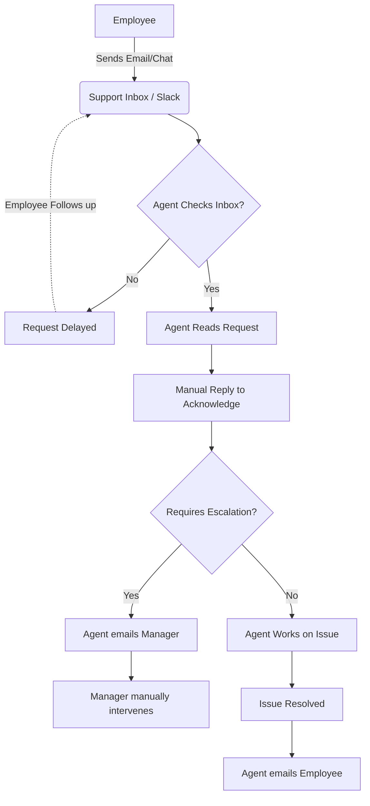
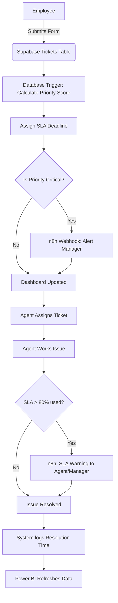
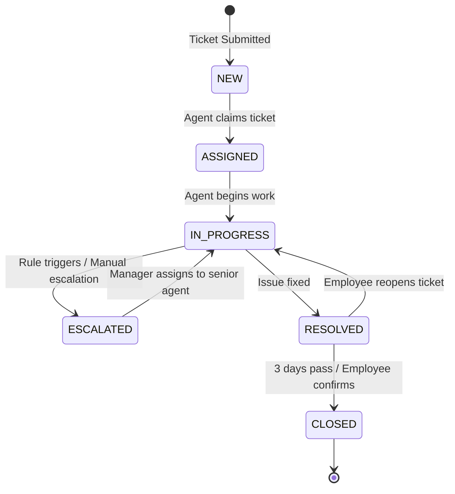
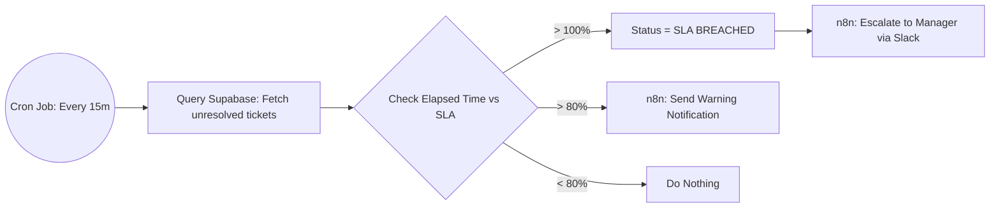

# Process Flow Diagrams

## Project Title
Enterprise Workflow Intelligence & SLA Analytics Platform

---

## 1. As-Is Process Flow (Current State)
This diagram illustrates the current manual, inefficient process.

---

## 2. To-Be Process Flow (Future State)
This diagram illustrates the automated, centralized workflow.

---

## 3. Ticket Lifecycle (State Machine)
This diagram illustrates the standardized states a ticket can move through.

---

## 4. Automated Escalation Logic Flow
This diagram breaks down the n8n logic for monitoring SLAs.

